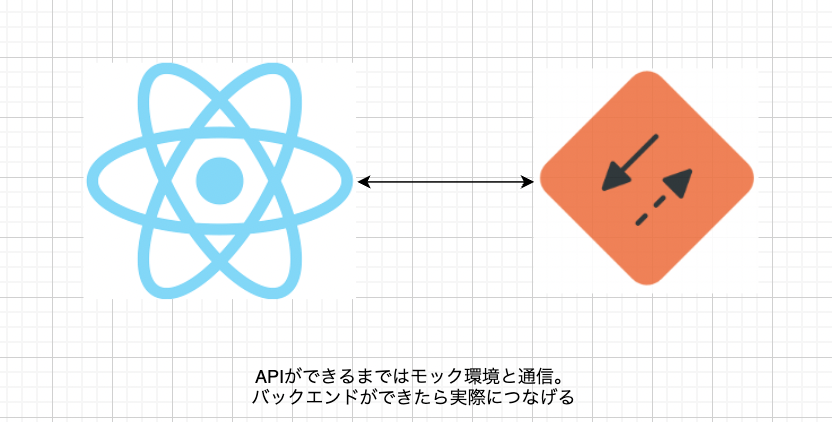

# REACT 課題

このディレクトリは React 課題を実施する場所となります。
React 課題は以下の通りです。

- React フォーム課題
  - とある会員登録ページフォームの実装をしてもらいます。
- React ブラックジャック課題
  - トランプゲーム「ブラックジャック」の簡易版ゲームの実装をしてもらいます。
- React 総合課題
  - ブログサービスの開発 PJ にアサインされた体で、フロントエンドの開発をしてもらいます。

# 終えた時の姿

- React.js を利用した機能実装が一人称で進めれる
- TypeScript を用いて、型安全な実装を進めることができる
- 再利用性の高いコンポーネント実装ができる
- コンポーネント設計の代表である Atomic Design を理解している
- API を叩くという、非同期処理実装を理解している
- git/github を利用したチーム開発手順を理解している
- モック環境の構築ができるようになる

# ドキュメント

- React フォーム課題
  - [React フォーム課題](https://www.notion.so/arpeggio-inc/React-de9935e4023d42e79b854719ab09d1ce)
- React ブラックジャック課題
  - [React ブラックジャック課題](https://www.notion.so/arpeggio-inc/React-171548061dde43728a179a9637e08824)
- React 総合課題
  - [React 総合課題](https://www.notion.so/arpeggio-inc/React-21246a7d956e4330950958734e89c2f4)

# 環境構築

- `node.js`のインストール（nodebrew など利用することを推奨）
- `yarn`のインストール（Homebrew など利用することを推奨）
- このディレクトリで下記を実施
  - yarn install
    - パッケージのインストール
  - yarn start
    - ローカル環境が立ち上がることを確認

# 開発について（以下は、主に React 総合課題にて使用する情報です）

## ディレクトリ構成

```
- src
  - pages
    - ページコンポーネント置き場
  - components/{コンポーネント単位}
    - コンポーネント管理セクションを参照してください
  - utils/
    - どのページでも利用するような共通ファイルを置く場所
```

## 実装方針

- コンポーネントの実装は`関数コンポーネント`\* `Hooks`で統一する
- コンポーネントはどのページでも利用しやすいように再利用性を考慮する
- コンポーネントの役割を明確化する
  - 見た目の責任を負うコンポーネントなら、ロジックの責任は持たない
  - ロジックの責任を負うコンポーネントなら、見た目の責任は持たない

## コンポーネント管理

コンポーネント管理に `Atomic Design` を採用します。

- components/
  - atoms
    - 最小単位のパーツ
    - 再利用できるように独自ロジックを持たない
  - molecules
    - atoms を組み合わせた 再利用パーツ群
    - 再利用できるように独自ロジックを持たない
  - organisms
    - atoms と molecules を組み合わせた 1 機能
    - 再利用性はあまり意識しなくて良い
    - 1 機能のためロジックの責任を持つ

※Atomic Design については[こちら](https://blog.spacemarket.com/code/atomic-design%E3%82%92%E4%BD%BF%E3%81%A3%E3%81%A6react%E3%82%B3%E3%83%B3%E3%83%9D%E3%83%BC%E3%83%8D%E3%83%B3%E3%83%88%E3%82%92%E5%86%8D%E8%A8%AD%E8%A8%88%E3%81%97%E3%81%9F%E8%A9%B1/)を参照

※Atomic Design の template は今回採用していません

## スタイリング

本 PJ では[tailwind css](https://tailwindcss.com/)を採用しています。
tailwind が提供してくれる Utility Class を利用してスタイルを当ててください。

スタイルの調査は[チートシート](https://tailwindcomponents.com/cheatsheet/)を参照すると早いと思います

## API との疎通

ローカル環境は API と疎通しません。  
代わりに src/mocks ディレクトリで [msw](https://mswjs.io/) を利用してモックサーバーを立てています。

上記を利用して interface 仕様書通りの API を作ってください。



# 補足

- この課題で実際に Laravel API とつながることはありません。React と msw を利用してローカル環境でブログサービスができれば課題完了となります
